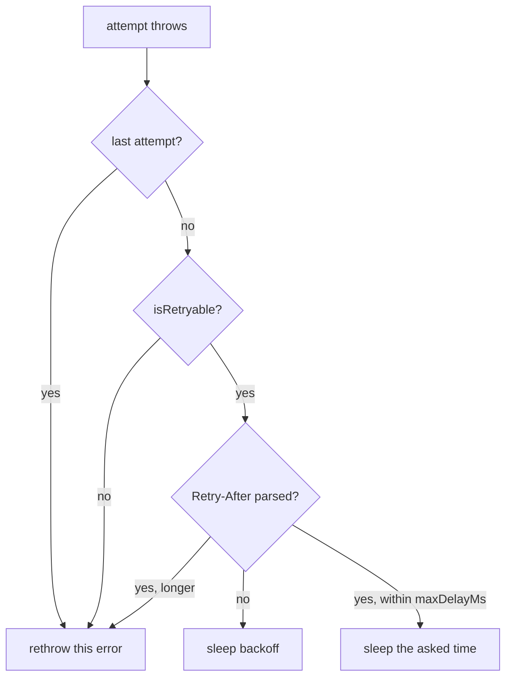

# `behavior-edge-case`, attempt `1`, `2026-10-08`

## Inputs

- **Instruction revision:** gyst commit `4ccc632528de6523bc2571ca51b030519e2e5343` the package was
  packed from; last commit to `apps/gyst/skills/gyst/`: `c2fc512386e818e737a08c374480f5dc680f674d`
  (last to `apps/gyst/skills/` as a whole: `5967e6c2a6f9c39d6b491b8f26597e34076dddcf`);
  `@gyst/cli` `0.1.2`, tarball sha256
  `62256a80f03b5a61bde946a617bb0df33fe82fb8f6e1ea795bca87abd661603b`.
- **Case:** `behavior-edge-case.bundle`, scope `main...feature`, commits `main` `8375991bbdb936544ef57d7ecc6a3de8b4280ef7`, `feature` `eee7cb5df50a952ac2ce23283eca3f847877565c`.
- **Request given to the agent:** passed as pi's message argument, verbatim:

  ```text
  /skill:gyst Prepare a gyst walkthrough of the Git range main...feature in this repository.
  ```

- **Model and harness:** pi `1.0.4` in print mode (`pi -p`), `anthropic/claude-opus-5-5`, thinking
  level `high` (the pi settings default). Flags: `--no-skills`, `--no-context-files`,
  `--no-prompt-templates`, `--no-extensions`, `--no-mcp`, three `--skill` paths and a new
  `--session-dir`.
  Run from 2026-10-08T23:19:19Z to 2026-10-08T23:21:35Z.
- **Fresh session:** a new pi session with its own session directory and no earlier conversation.
  The process ran under `env -i` with `HOME` and the XDG directories set to an isolated
  `/tmp/gyst-98b-home`; only pi's own config directory (`PI_CODING_AGENT_DIR`) pointed at the real
  one, for its credentials and model settings. Skill, extension, prompt-template, MCP and
  context-file discovery were off, and the only skills were the clone's
  `.agents/skills/{gyst,gyst-respond,gyst-cli}` links into the installed package. The session's
  system message lists exactly `gyst` and `gyst-cli` (`gyst-respond` is loaded but hidden from the
  model by its `disable-model-invocation`). `PATH` held only the installed `gyst`, Node 24.21.0 and
  `/run/current-system/sw/bin` (no `python3` or `jq`); pi's bash tool adds its own ripgrep and fd. `GYST_DATA_DIR` was a new `/tmp/gyst-98b-data`, shared by the four
  cases in turn, with `GYST_PORT=5598`; this case's `open` reported `created: true`.
- **Previous attempts:** none.

## Outputs

- **Session:** `18a078a6-4764-44bc-bb79-3c9f1e9205ac`, snapshot
  `a1b21a911766b80027345dfaa6282e5558fb1784c743d28c6f00001d6fae333c`.
- **Final status:** [`2026-10-08-behavior-edge-case-1.status.json`](2026-10-08-behavior-edge-case-1.status.json).
- **Rejected batches:** None. Three batches, each accepted on first submission (revisions 1, 2 and 3); no `validation_failed`, `stale_revision` or other gyst error appears in the transcript. One read-only loop piping `gyst session code` into `jq`, which is not on the generator's `PATH`, printed `jq: command not found`; the agent reran it with `node`.
- **Questions:** none. Print mode has no human to answer, and the agent asked nothing.

## Structural check

**Pass.** `preparation.state` is `complete`: `groupedHunks` 9 of `totalHunks` 9, `overviewMissing` `false`, `overviewOutdated` `false`, `groupsMissingOverview` `[]`, `groupsOutdated` `[]`, `notesOutdated` `[]`. Final revision 3, 4 groups, 14 notes.

## Human verdict

Filled in by the human evaluator only.

- **Evaluator and date:**
- **Correctness and evidence:**
- **Mental-model clarity:**
- **Meaningful-step coverage:**
- **Useful examples and references:**
- **Standalone readability:**
- **Economy:**
- **Verdict:** accepted / failed, with the concrete reasons.

## Appendix: the published walkthrough

Exported from the final status [`2026-10-08-behavior-edge-case-1.status.json`](./2026-10-08-behavior-edge-case-1.status.json) (revision 3) and `gyst session diff` for the same snapshot. Overviews and notes are the agent's Markdown, unedited; each sits between rules. Headings, hunk lists and code excerpts (read with `gyst session code`) were added for reading only. The repository formatter (`vp fmt`, part of `pnpm check`) normalizes this file without changing what it renders: emphasis written `*x*` reads `_x_` here, tables are padded and trailing spaces in excerpts are dropped. The status file holds the exact text; the formatter only re-indents its JSON.

### Walkthrough overview

---

Before this change, `withRetry` retried **every** failure with capped exponential backoff: a `404` was fetched four times, and a server's `Retry-After` header was never read. Now each failed attempt answers two questions before any wait: _is this error worth retrying?_ and _how long should we wait?_ A client error (4xx other than 408/429) stops at once; otherwise a parseable `Retry-After` replaces the backoff, unless it asks for more than `maxDelayMs`, in which case the call also stops at once.



Read it along the data flow:

1. **Carry `Retry-After` on `HttpError`**: the response header travels with the thrown error.
2. **Parse `Retry-After` into milliseconds**: a pure function and its tests.
3. **Decide whether and how long to retry**: the policy in `withRetry` and its end-to-end tests.
4. **Document the retry policy**: the README.

Verification: ran `npm test` (Node v24.21.0) on a checkout of `feature` at `eee7cb5`, the snapshot's new side: 12 tests pass.

---

### Group 1: Carry Retry-After on HttpError

Id `carry-retry-after`; files `src/client.ts`, `src/http-error.ts`.

---

Plumbing only: `fetchJson` copies the raw header onto the error it throws for a non-2xx response, so the retry policy, which only sees the error, can read it. Start at [the throw in `fetchJson`](gyst:new/src/client.ts#L14-L15), then the new field on [`HttpError`](gyst:new/src/http-error.ts#L5-L13). No retry behavior changes in this group.

---

<details><summary>Reference 1: <code>src/client.ts</code> new lines 14–15</summary>

```text
  14      if (!response.ok)
  15        throw new HttpError(response.status, url, response.headers.get("retry-after") ?? undefined);
```

</details>
<details><summary>Reference 2: <code>src/http-error.ts</code> new lines 5–13</summary>

```text
   5    /** The raw `Retry-After` header, when the server sent one. */
   6    readonly retryAfter: string | undefined;
   7
   8    constructor(status: number, url: string, retryAfter?: string) {
   9      super(`GET ${url} failed with ${status}`);
  10      this.name = "HttpError";
  11      this.status = status;
  12      this.url = url;
  13      this.retryAfter = retryAfter;
```

</details>

#### Hunks, in order

<details><summary><code>src/client.ts</code> <code>@@ -11,7 +11,8 @@</code> (7e4fff59f6ef6c20)</summary>

```diff
@@ -11,7 +11,8 @@ export function fetchJson<T>(
 ): Promise<T> {
   return withRetry(async () => {
     const response = await fetchImpl(url, { headers: { accept: "application/json" } });
-    if (!response.ok) throw new HttpError(response.status, url);
+    if (!response.ok)
+      throw new HttpError(response.status, url, response.headers.get("retry-after") ?? undefined);
     return (await response.json()) as T;
   }, retry);
 }
```

</details>

<details><summary><code>src/http-error.ts</code> <code>@@ -2,11 +2,14 @@</code> (f92aa03c919ecd0d)</summary>

```diff
@@ -2,11 +2,14 @@
 export class HttpError extends Error {
   readonly status: number;
   readonly url: string;
+  /** The raw `Retry-After` header, when the server sent one. */
+  readonly retryAfter: string | undefined;

-  constructor(status: number, url: string) {
+  constructor(status: number, url: string, retryAfter?: string) {
     super(`GET ${url} failed with ${status}`);
     this.name = "HttpError";
     this.status = status;
     this.url = url;
+    this.retryAfter = retryAfter;
   }
 }
```

</details>

#### Note 1.1 (`client-header-read`) on `src/client.ts` new lines 14–15

<details><summary>Anchored lines: <code>src/client.ts</code> new lines 14–15</summary>

```text
  14      if (!response.ok)
  15        throw new HttpError(response.status, url, response.headers.get("retry-after") ?? undefined);
```

</details>

---

`Headers.get` returns `null` when the header is absent; `?? undefined` normalizes that to the optional parameter's `undefined`. The header is captured for every non-2xx status, including 4xx that will not be retried.

---

#### Note 1.2 (`http-error-raw-field`) on `src/http-error.ts` new lines 5–8

<details><summary>Anchored lines: <code>src/http-error.ts</code> new lines 5–8</summary>

```text
   5    /** The raw `Retry-After` header, when the server sent one. */
   6    readonly retryAfter: string | undefined;
   7
   8    constructor(status: number, url: string, retryAfter?: string) {
```

</details>

---

The header is stored raw, not parsed: an HTTP-date only becomes a wait relative to the clock at decision time, which [`retryDelay`](gyst:new/src/retry.ts#L63-L73) supplies. The parameter is optional, so existing `new HttpError(status, url)` calls still compile.

---

<details><summary>Reference 1: <code>src/retry.ts</code> new lines 63–73</summary>

```text
  63  export function retryDelay(
  64    error: unknown,
  65    attempt: number,
  66    options: RetryOptions,
  67    nowMs: number,
  68  ): number | undefined {
  69    const asked =
  70      error instanceof HttpError ? parseRetryAfter(error.retryAfter, nowMs) : undefined;
  71    if (asked === undefined) return backoff(attempt, options);
  72    return asked <= options.maxDelayMs ? asked : undefined;
  73  }
```

</details>

### Group 2: Parse Retry-After into milliseconds

Id `parse-retry-after`; files `src/retry-after.ts`, `test/retry-after.test.ts`.

---

[`parseRetryAfter`](gyst:new/src/retry-after.ts#L6-L13) turns the raw header into a wait in milliseconds, or `undefined` meaning "no usable value, fall back to backoff". It does not cap the value; the cap is applied by the policy in the next group. Read the function, then [its tests](gyst:new/test/retry-after.test.ts#L8-L26).

For example, with now = 2025-03-01 12:00:00 GMT:

| Header                                 | Result      |
| -------------------------------------- | ----------- |
| `3`                                    | `3000`      |
| `Sat, 01 Mar 2025 12:00:02 GMT`        | `2000`      |
| `Sat, 01 Mar 2025 11:59:00 GMT` (past) | `0`         |
| `soon`, absent                         | `undefined` |

---

<details><summary>Reference 1: <code>src/retry-after.ts</code> new lines 6–13</summary>

```text
   6  export function parseRetryAfter(value: string | undefined, nowMs: number): number | undefined {
   7    if (value === undefined) return undefined;
   8    const text = value.trim();
   9    if (/^\d+$/.test(text)) return Number(text) * 1_000;
  10    const date = Date.parse(text);
  11    if (Number.isNaN(date)) return undefined;
  12    return Math.max(0, date - nowMs);
  13  }
```

</details>
<details><summary>Reference 2: <code>test/retry-after.test.ts</code> new lines 8–26</summary>

```text
   8  describe("parseRetryAfter", () => {
   9    it("reads delay-seconds", () => {
  10      assert.equal(parseRetryAfter("3", now), 3_000);
  11      assert.equal(parseRetryAfter(" 0 ", now), 0);
  12    });
  13
  14    it("reads an HTTP-date relative to now", () => {
  15      assert.equal(parseRetryAfter("Sat, 01 Mar 2025 12:00:02 GMT", now), 2_000);
  16    });
  17
  18    it("treats a date already past as retry now", () => {
  19      assert.equal(parseRetryAfter("Sat, 01 Mar 2025 11:59:00 GMT", now), 0);
  20    });
  21
  22    it("ignores a value that is neither", () => {
  23      assert.equal(parseRetryAfter("soon", now), undefined);
  24      assert.equal(parseRetryAfter(undefined, now), undefined);
  25    });
  26  });
```

</details>

#### Hunks, in order

<details><summary><code>src/retry-after.ts</code> <code>@@ -0,0 +1,13 @@</code> (088624a79a40ca10)</summary>

```diff
@@ -0,0 +1,13 @@
+/**
+ * Reads a `Retry-After` header as delay-seconds or an HTTP-date (RFC 9110, section 10.2.3), in
+ * milliseconds from `nowMs`. A date already past means "retry now", so it is 0. A value that is
+ * neither is ignored (`undefined`).
+ */
+export function parseRetryAfter(value: string | undefined, nowMs: number): number | undefined {
+  if (value === undefined) return undefined;
+  const text = value.trim();
+  if (/^\d+$/.test(text)) return Number(text) * 1_000;
+  const date = Date.parse(text);
+  if (Number.isNaN(date)) return undefined;
+  return Math.max(0, date - nowMs);
+}
```

</details>

<details><summary><code>test/retry-after.test.ts</code> <code>@@ -0,0 +1,26 @@</code> (ace6db35c7228671)</summary>

```diff
@@ -0,0 +1,26 @@
+import assert from "node:assert/strict";
+import { describe, it } from "node:test";
+
+import { parseRetryAfter } from "../src/retry-after.ts";
+
+const now = Date.parse("2025-03-01T12:00:00Z");
+
+describe("parseRetryAfter", () => {
+  it("reads delay-seconds", () => {
+    assert.equal(parseRetryAfter("3", now), 3_000);
+    assert.equal(parseRetryAfter(" 0 ", now), 0);
+  });
+
+  it("reads an HTTP-date relative to now", () => {
+    assert.equal(parseRetryAfter("Sat, 01 Mar 2025 12:00:02 GMT", now), 2_000);
+  });
+
+  it("treats a date already past as retry now", () => {
+    assert.equal(parseRetryAfter("Sat, 01 Mar 2025 11:59:00 GMT", now), 0);
+  });
+
+  it("ignores a value that is neither", () => {
+    assert.equal(parseRetryAfter("soon", now), undefined);
+    assert.equal(parseRetryAfter(undefined, now), undefined);
+  });
+});
```

</details>

#### Note 2.1 (`parse-delay-seconds`) on `src/retry-after.ts` new lines 7–9

<details><summary>Anchored lines: <code>src/retry-after.ts</code> new lines 7–9</summary>

```text
   7    if (value === undefined) return undefined;
   8    const text = value.trim();
   9    if (/^\d+$/.test(text)) return Number(text) * 1_000;
```

</details>

---

Only plain digits (after trimming) count as delay-seconds. `0` is a valid answer meaning retry immediately, which is shorter than any backoff; there is no upper bound here.

---

#### Note 2.2 (`parse-date-leniency`) on `src/retry-after.ts` new lines 10–12

<details><summary>Anchored lines: <code>src/retry-after.ts</code> new lines 10–12</summary>

```text
  10    const date = Date.parse(text);
  11    if (Number.isNaN(date)) return undefined;
  12    return Math.max(0, date - nowMs);
```

</details>

---

Edge case: `Date.parse` accepts more than RFC 9110 HTTP-dates, so "neither" in the doc comment only covers strings it rejects. Ran a probe on the snapshot's code with Node v24.21.0: `-1` and `1.5` parse as past dates and return `0` (an immediate retry, not the backoff fallback), and an ISO string such as `2025-03-01T12:00:03Z` returns `3000`. Other engines may differ; no test pins these inputs.

---

#### Note 2.3 (`parse-tests`) on `test/retry-after.test.ts` new lines 8–26

<details><summary>Anchored lines: <code>test/retry-after.test.ts</code> new lines 8–26</summary>

```text
   8  describe("parseRetryAfter", () => {
   9    it("reads delay-seconds", () => {
  10      assert.equal(parseRetryAfter("3", now), 3_000);
  11      assert.equal(parseRetryAfter(" 0 ", now), 0);
  12    });
  13
  14    it("reads an HTTP-date relative to now", () => {
  15      assert.equal(parseRetryAfter("Sat, 01 Mar 2025 12:00:02 GMT", now), 2_000);
  16    });
  17
  18    it("treats a date already past as retry now", () => {
  19      assert.equal(parseRetryAfter("Sat, 01 Mar 2025 11:59:00 GMT", now), 0);
  20    });
  21
  22    it("ignores a value that is neither", () => {
  23      assert.equal(parseRetryAfter("soon", now), undefined);
  24      assert.equal(parseRetryAfter(undefined, now), undefined);
  25    });
  26  });
```

</details>

---

Covers both header forms, a past date clamping to `0`, whitespace around a number, and the `undefined` fallbacks. Included in the passing `npm test` run.

---

### Group 3: Decide whether and how long to retry

Id `retry-policy`; files `src/retry.ts`, `test/retry.test.ts`.

---

The behavior change lives in [the `withRetry` loop](gyst:new/src/retry.ts#L31-L42), which now consults two new helpers: [`isRetryable`](gyst:new/src/retry.ts#L54-L57) decides whether to retry at all, and [`retryDelay`](gyst:new/src/retry.ts#L63-L73) picks the wait or says stop. [`backoff`](gyst:new/src/retry.ts#L46-L48) itself is unchanged. Then read the new `fetchJson` tests, which use `attempts: 4`, `baseDelayMs: 100`, `maxDelayMs: 1000` and a fixed clock.

For example, under those test options:

| First response            | Before                       | After                                 |
| ------------------------- | ---------------------------- | ------------------------------------- |
| `404`                     | 4 calls, waits 100, 200, 400 | 1 call, no wait                       |
| `429`, `Retry-After: 1`   | waits 100 (header ignored)   | waits 1000                            |
| `503`, `Retry-After: 120` | waits 100 (header ignored)   | 1 call, rejects with that `HttpError` |
| `503`, no header          | waits 100                    | waits 100 (unchanged)                 |

---

<details><summary>Reference 1: <code>src/retry.ts</code> new lines 31–42</summary>

```text
  31    for (let attempt = 1; attempt <= options.attempts; attempt++) {
  32      try {
  33        return await call();
  34      } catch (error) {
  35        lastError = error;
  36        if (attempt === options.attempts || !isRetryable(error)) break;
  37        const delay = retryDelay(error, attempt, options, now());
  38        if (delay === undefined) break;
  39        await sleep(delay);
  40      }
  41    }
  42    throw lastError;
```

</details>
<details><summary>Reference 2: <code>src/retry.ts</code> new lines 54–57</summary>

```text
  54  export function isRetryable(error: unknown): boolean {
  55    if (!(error instanceof HttpError)) return true;
  56    return error.status === 408 || error.status === 429 || error.status >= 500;
  57  }
```

</details>
<details><summary>Reference 3: <code>src/retry.ts</code> new lines 63–73</summary>

```text
  63  export function retryDelay(
  64    error: unknown,
  65    attempt: number,
  66    options: RetryOptions,
  67    nowMs: number,
  68  ): number | undefined {
  69    const asked =
  70      error instanceof HttpError ? parseRetryAfter(error.retryAfter, nowMs) : undefined;
  71    if (asked === undefined) return backoff(attempt, options);
  72    return asked <= options.maxDelayMs ? asked : undefined;
  73  }
```

</details>
<details><summary>Reference 4: <code>src/retry.ts</code> new lines 46–48</summary>

```text
  46  export function backoff(attempt: number, options: RetryOptions): number {
  47    return Math.min(options.baseDelayMs * 2 ** (attempt - 1), options.maxDelayMs);
  48  }
```

</details>

#### Hunks, in order

<details><summary><code>src/retry.ts</code> <code>@@ -1,31 +1,42 @@</code> (119e8143a711e39a)</summary>

```diff
@@ -1,31 +1,42 @@
+import { HttpError } from "./http-error.ts";
+import { parseRetryAfter } from "./retry-after.ts";
+
 export interface RetryOptions {
   /** Attempts in total, including the first. */
   readonly attempts: number;
   /** The wait before the first retry; each later retry doubles it. */
   readonly baseDelayMs: number;
-  /** No single wait is longer than this. */
+  /** No single wait is longer than this, including one a server asks for. */
   readonly maxDelayMs: number;
   readonly sleep?: (ms: number) => Promise<void>;
+  readonly now?: () => number;
 }

 export const defaultRetry: RetryOptions = { attempts: 4, baseDelayMs: 200, maxDelayMs: 5_000 };

 const realSleep = (ms: number) => new Promise<void>((resolve) => setTimeout(resolve, ms));

-/** Calls `call` until it resolves or the attempts run out, then rethrows the last error. */
+/**
+ * Calls `call` until it resolves, then returns its result. Stops early and rethrows when the
+ * error is not worth retrying or the server asks for a longer wait than `maxDelayMs`; otherwise
+ * rethrows the last error once the attempts run out.
+ */
 export async function withRetry<T>(
   call: () => Promise<T>,
   options: RetryOptions = defaultRetry,
 ): Promise<T> {
   const sleep = options.sleep ?? realSleep;
+  const now = options.now ?? Date.now;
   let lastError: unknown;
   for (let attempt = 1; attempt <= options.attempts; attempt++) {
     try {
       return await call();
     } catch (error) {
       lastError = error;
-      if (attempt === options.attempts) break;
-      await sleep(backoff(attempt, options));
+      if (attempt === options.attempts || !isRetryable(error)) break;
+      const delay = retryDelay(error, attempt, options, now());
+      if (delay === undefined) break;
+      await sleep(delay);
     }
   }
   throw lastError;
```

</details>

<details><summary><code>src/retry.ts</code> <code>@@ -35,3 +46,28 @@</code> (ab588adef2fcc851)</summary>

```diff
@@ -35,3 +46,28 @@ export async function withRetry<T>(
 export function backoff(attempt: number, options: RetryOptions): number {
   return Math.min(options.baseDelayMs * 2 ** (attempt - 1), options.maxDelayMs);
 }
+
+/**
+ * Network failures, timeouts (408), throttling (429) and server errors (5xx) may succeed later.
+ * Any other 4xx means the request itself is wrong, so repeating it cannot help.
+ */
+export function isRetryable(error: unknown): boolean {
+  if (!(error instanceof HttpError)) return true;
+  return error.status === 408 || error.status === 429 || error.status >= 500;
+}
+
+/**
+ * The wait before the next attempt: what the server asked for in `Retry-After`, otherwise the
+ * backoff. `undefined` means stop: the server asked for more than `maxDelayMs`.
+ */
+export function retryDelay(
+  error: unknown,
+  attempt: number,
+  options: RetryOptions,
+  nowMs: number,
+): number | undefined {
+  const asked =
+    error instanceof HttpError ? parseRetryAfter(error.retryAfter, nowMs) : undefined;
+  if (asked === undefined) return backoff(attempt, options);
+  return asked <= options.maxDelayMs ? asked : undefined;
+}
```

</details>

<details><summary><code>test/retry.test.ts</code> <code>@@ -10,8 +10,10 @@</code> (1b8996736e3253d5)</summary>

```diff
@@ -10,8 +10,10 @@ function recordingSleep() {
   return { waits, sleep: async (ms: number) => void waits.push(ms) };
 }

+const now = Date.parse("2025-03-01T12:00:00Z");
+
 function options(sleep: (ms: number) => Promise<void>): RetryOptions {
-  return { attempts: 4, baseDelayMs: 100, maxDelayMs: 1_000, sleep };
+  return { attempts: 4, baseDelayMs: 100, maxDelayMs: 1_000, sleep, now: () => now };
 }

 /** A fetch that answers with each response in turn. */
```

</details>

<details><summary><code>test/retry.test.ts</code> <code>@@ -76,4 +78,38 @@</code> (3c47e1117ea54544)</summary>

```diff
@@ -76,4 +78,38 @@ describe("fetchJson", () => {
       (error) => error instanceof HttpError && error.status === 500,
     );
   });
+
+  it("fails at once on a client error", async () => {
+    const { waits, sleep } = recordingSleep();
+    const { fetchImpl, calls } = scripted(new Response("no such user", { status: 404 }));
+    await assert.rejects(
+      fetchJson("https://api.test/u/404", fetchImpl, options(sleep)),
+      (error) => error instanceof HttpError && error.status === 404,
+    );
+    assert.equal(calls(), 1);
+    assert.deepEqual(waits, []);
+  });
+
+  it("waits as long as Retry-After asks instead of backing off", async () => {
+    const { waits, sleep } = recordingSleep();
+    const { fetchImpl } = scripted(
+      new Response("slow down", { status: 429, headers: { "retry-after": "1" } }),
+      Response.json({ id: 42 }),
+    );
+    await fetchJson("https://api.test/u/42", fetchImpl, options(sleep));
+    assert.deepEqual(waits, [1_000]);
+  });
+
+  it("fails at once when Retry-After asks for longer than maxDelayMs", async () => {
+    const { waits, sleep } = recordingSleep();
+    const { fetchImpl, calls } = scripted(
+      new Response("maintenance", { status: 503, headers: { "retry-after": "120" } }),
+    );
+    await assert.rejects(
+      fetchJson("https://api.test/u/42", fetchImpl, options(sleep)),
+      (error) => error instanceof HttpError && error.retryAfter === "120",
+    );
+    assert.equal(calls(), 1);
+    assert.deepEqual(waits, []);
+  });
 });
```

</details>

#### Note 3.1 (`old-retry-everything`) on `src/retry.ts` old lines 27–28

<details><summary>Anchored lines: <code>src/retry.ts</code> old lines 27–28</summary>

```text
  27        if (attempt === options.attempts) break;
  28        await sleep(backoff(attempt, options));
```

</details>

---

Before: the only exit was running out of attempts, and every wait was `backoff`.

---

#### Note 3.2 (`injected-now`) on `src/retry.ts` new lines 9–12

<details><summary>Anchored lines: <code>src/retry.ts</code> new lines 9–12</summary>

```text
   9    /** No single wait is longer than this, including one a server asks for. */
  10    readonly maxDelayMs: number;
  11    readonly sleep?: (ms: number) => Promise<void>;
  12    readonly now?: () => number;
```

</details>

---

`now` is optional and defaults to `Date.now` ([line 29](gyst:new/src/retry.ts#L29)), so existing callers are unaffected; it only matters for HTTP-date headers. `maxDelayMs` now also bounds a server-requested wait, as a stop condition rather than a clamp.

---

<details><summary>Reference 1: <code>src/retry.ts</code> new lines 29–29</summary>

```text
  29    const now = options.now ?? Date.now;
```

</details>

#### Note 3.3 (`loop-exit-order`) on `src/retry.ts` new lines 36–39

<details><summary>Anchored lines: <code>src/retry.ts</code> new lines 36–39</summary>

```text
  36        if (attempt === options.attempts || !isRetryable(error)) break;
  37        const delay = retryDelay(error, attempt, options, now());
  38        if (delay === undefined) break;
  39        await sleep(delay);
```

</details>

---

Checks run in order: last attempt, then retryability, then delay. So `Retry-After` is never read on the last attempt or on a non-retryable status: a `404` carrying `Retry-After: 1` fails after one call with no wait (ran a probe on the snapshot's code). Every early stop rethrows the error itself, so the caller sees the real status and header.

---

#### Note 3.4 (`is-retryable`) on `src/retry.ts` new lines 54–57

<details><summary>Anchored lines: <code>src/retry.ts</code> new lines 54–57</summary>

```text
  54  export function isRetryable(error: unknown): boolean {
  55    if (!(error instanceof HttpError)) return true;
  56    return error.status === 408 || error.status === 429 || error.status >= 500;
  57  }
```

</details>

---

Anything that is not an `HttpError` stays retryable. That covers network failures, and also a `SyntaxError` from `response.json()` on a 2xx with a malformed body: a probe showed 4 calls with waits 100, 200, 400. That was already the case before this change; 1xx/3xx never reach here because only `!response.ok` throws `HttpError`, and fetch follows redirects by default.

---

#### Note 3.5 (`retry-delay-boundary`) on `src/retry.ts` new lines 69–72

<details><summary>Anchored lines: <code>src/retry.ts</code> new lines 69–72</summary>

```text
  69    const asked =
  70      error instanceof HttpError ? parseRetryAfter(error.retryAfter, nowMs) : undefined;
  71    if (asked === undefined) return backoff(attempt, options);
  72    return asked <= options.maxDelayMs ? asked : undefined;
```

</details>

---

Boundary: `<=` means a request for exactly `maxDelayMs` is honored; one millisecond more stops the call instead of waiting the cap. A parsed value always replaces the backoff, even when shorter, so `Retry-After: 0` or a past date retries immediately.

---

#### Note 3.6 (`test-fixed-clock`) on `test/retry.test.ts` new lines 13–16

<details><summary>Anchored lines: <code>test/retry.test.ts</code> new lines 13–16</summary>

```text
  13  const now = Date.parse("2025-03-01T12:00:00Z");
  14
  15  function options(sleep: (ms: number) => Promise<void>): RetryOptions {
  16    return { attempts: 4, baseDelayMs: 100, maxDelayMs: 1_000, sleep, now: () => now };
```

</details>

---

The fixed clock keeps the options deterministic; none of these tests sends an HTTP-date, so it is not exercised end to end here (only in the `parseRetryAfter` tests).

---

#### Note 3.7 (`test-client-error`) on `test/retry.test.ts` new lines 82–91

<details><summary>Anchored lines: <code>test/retry.test.ts</code> new lines 82–91</summary>

```text
  82    it("fails at once on a client error", async () => {
  83      const { waits, sleep } = recordingSleep();
  84      const { fetchImpl, calls } = scripted(new Response("no such user", { status: 404 }));
  85      await assert.rejects(
  86        fetchJson("https://api.test/u/404", fetchImpl, options(sleep)),
  87        (error) => error instanceof HttpError && error.status === 404,
  88      );
  89      assert.equal(calls(), 1);
  90      assert.deepEqual(waits, []);
  91    });
```

</details>

---

Pins the main behavior change: one call, no waits. No test covers 408 or 429-without-header still being retried.

---

#### Note 3.8 (`test-retry-after-boundary`) on `test/retry.test.ts` new lines 93–114

<details><summary>Anchored lines: <code>test/retry.test.ts</code> new lines 93–114</summary>

```text
  93    it("waits as long as Retry-After asks instead of backing off", async () => {
  94      const { waits, sleep } = recordingSleep();
  95      const { fetchImpl } = scripted(
  96        new Response("slow down", { status: 429, headers: { "retry-after": "1" } }),
  97        Response.json({ id: 42 }),
  98      );
  99      await fetchJson("https://api.test/u/42", fetchImpl, options(sleep));
 100      assert.deepEqual(waits, [1_000]);
 101    });
 102
 103    it("fails at once when Retry-After asks for longer than maxDelayMs", async () => {
 104      const { waits, sleep } = recordingSleep();
 105      const { fetchImpl, calls } = scripted(
 106        new Response("maintenance", { status: 503, headers: { "retry-after": "120" } }),
 107      );
 108      await assert.rejects(
 109        fetchJson("https://api.test/u/42", fetchImpl, options(sleep)),
 110        (error) => error instanceof HttpError && error.retryAfter === "120",
 111      );
 112      assert.equal(calls(), 1);
 113      assert.deepEqual(waits, []);
 114    });
```

</details>

---

`Retry-After: 1` is 1000 ms, exactly `maxDelayMs` in these options, so the first test also pins the `<=` boundary. The second pins the stop: one call, no waits, and the rejected error still carries `retryAfter: "120"`. Both pass in the `npm test` run.

---

### Group 4: Document the retry policy

Id `readme-policy`; files `README.md`.

---

The README's retry section is rewritten to match the new policy. Its numbers are those of [`defaultRetry`](gyst:new/src/retry.ts#L15): 4 attempts, 200 ms base, 5 s cap.

---

<details><summary>Reference 1: <code>src/retry.ts</code> new lines 15–15</summary>

```text
  15  export const defaultRetry: RetryOptions = { attempts: 4, baseDelayMs: 200, maxDelayMs: 5_000 };
```

</details>

#### Hunks, in order

<details><summary><code>README.md</code> <code>@@ -13,5 +13,9 @@</code> (46447eb37e682faf)</summary>

```diff
@@ -13,5 +13,9 @@ Run the tests with `npm test` (Node 24 runs the TypeScript directly).

 ## Retry policy

-Every failure is retried, up to 4 attempts in total. The first retry waits 200 ms and each later
-one doubles that, never waiting more than 5 s.
+Network errors, 408, 429 and 5xx responses are retried, up to 4 attempts in total. Other 4xx
+responses fail at once. The first retry waits 200 ms and each later one doubles that, never
+waiting more than 5 s.
+
+A server's `Retry-After` header replaces the backoff for that wait. When it asks for more than 5 s,
+`fetchJson` fails at once with that response's `HttpError` instead of waiting.
```

</details>

#### Note 4.1 (`readme-scope`) on `README.md` new lines 16–21

<details><summary>Anchored lines: <code>README.md</code> new lines 16–21</summary>

```text
  16  Network errors, 408, 429 and 5xx responses are retried, up to 4 attempts in total. Other 4xx
  17  responses fail at once. The first retry waits 200 ms and each later one doubles that, never
  18  waiting more than 5 s.
  19
  20  A server's `Retry-After` header replaces the backoff for that wait. When it asks for more than 5 s,
  21  `fetchJson` fails at once with that response's `HttpError` instead of waiting.
```

</details>

---

"Network errors" understates what is retried: any non-`HttpError`, such as a JSON decode failure on a 2xx, is retried too. The text also does not mention that a `Retry-After` is ignored on non-retryable 4xx or that an unparseable value falls back to the backoff.

---
