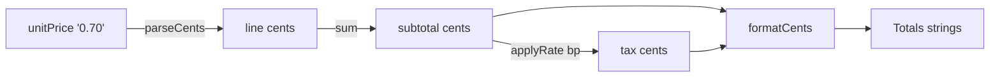

# `stack-layer`, attempt `1`, `2026-10-08`

## Inputs

- **Instruction revision:** gyst commit `4ccc632528de6523bc2571ca51b030519e2e5343` the package was
  packed from; last commit to `apps/gyst/skills/gyst/`: `c2fc512386e818e737a08c374480f5dc680f674d`
  (last to `apps/gyst/skills/` as a whole: `5967e6c2a6f9c39d6b491b8f26597e34076dddcf`);
  `@gyst/cli` `0.1.2`, tarball sha256
  `62256a80f03b5a61bde946a617bb0df33fe82fb8f6e1ea795bca87abd661603b`.
- **Case:** `stack-layer.bundle`, scope `layer-1...layer-2`, commits `main` `c8dad9d0f77c06c51a538125cbeadc019af27f4a`, `layer-1` `1bbfbcd993c92cbdae710aa17ad8e5ad353380f1`, `layer-2` `89290501ce1c6ca8607af054b9e81df57e00869d` (selected), `layer-3` `61b5e75d5e5be56e79a10c5ce41b6083199cda5a`.
- **Request given to the agent:** passed as pi's message argument, verbatim:

  ```text
  /skill:gyst Prepare a gyst walkthrough of the Git range layer-1...layer-2 in this repository.

  This range is the middle layer of a local three-layer stack, oldest first. Each layer is one commit on the branch below it, and its commit message is its description:

  1. `layer-1` (`main...layer-1`): Add integer-cent money helpers.
  2. `layer-2` (`layer-1...layer-2`): Compute invoice totals in integer cents. This is the selected layer.
  3. `layer-3` (`layer-2...layer-3`): Export invoices as CSV.

  Prepare only the selected layer. The titles are claims, not proof: read the other layers with Git when a claim about them matters.
  ```

- **Model and harness:** pi `1.0.4` in print mode (`pi -p`), `anthropic/claude-opus-5-5`, thinking
  level `high` (the pi settings default). Flags: `--no-skills`, `--no-context-files`,
  `--no-prompt-templates`, `--no-extensions`, `--no-mcp`, three `--skill` paths and a new
  `--session-dir`.
  Run from 2026-10-08T23:41:28Z to 2026-10-08T23:43:41Z.
- **Fresh session:** a new pi session with its own session directory and no earlier conversation.
  The process ran under `env -i` with `HOME` and the XDG directories set to an isolated
  `/tmp/gyst-98b-home`; only pi's own config directory (`PI_CODING_AGENT_DIR`) pointed at the real
  one, for its credentials and model settings. Skill, extension, prompt-template, MCP and
  context-file discovery were off, and the only skills were the clone's
  `.agents/skills/{gyst,gyst-respond,gyst-cli}` links into the installed package. The session's
  system message lists exactly `gyst` and `gyst-cli` (`gyst-respond` is loaded but hidden from the
  model by its `disable-model-invocation`). `PATH` held only the installed `gyst`, Node 24.21.0 and
  `/run/current-system/sw/bin` (no `python3` or `jq`); pi's bash tool adds its own ripgrep and fd. `GYST_DATA_DIR` was a new `/tmp/gyst-98b-data`, shared by the four
  cases in turn, with `GYST_PORT=5598`; this case's `open` reported `created: true`.
- **Previous attempts:** none.

## Outputs

- **Session:** `d08a31cd-220c-4e21-bd31-d5014152773c`, snapshot
  `1662b9ebfb8e6731f9ee6ccbb75dfa8d8dee18e6b14b5926461d68e287bda580`.
- **Final status:** [`2026-10-08-stack-layer-1.status.json`](2026-10-08-stack-layer-1.status.json).
- **Rejected batches:** None. Two batches, both accepted on first submission (revisions 1 and 2); no `validation_failed`, `stale_revision` or other gyst error appears in the transcript. One read-only loop piping `gyst session code` into `python3`, which is not on the generator's `PATH`, exited 127; the agent reran it differently. It was not a gyst command error.
- **Questions:** none. Print mode has no human to answer, and the agent asked nothing.

## Structural check

**Pass.** `preparation.state` is `complete`: `groupedHunks` 4 of `totalHunks` 4, `overviewMissing` `false`, `overviewOutdated` `false`, `groupsMissingOverview` `[]`, `groupsOutdated` `[]`, `notesOutdated` `[]`. Final revision 2, 2 groups, 7 notes.

## Human verdict

Filled in by the human evaluator only.

- **Evaluator and date:**
- **Correctness and evidence:**
- **Mental-model clarity:**
- **Meaningful-step coverage:**
- **Useful examples and references:**
- **Standalone readability:**
- **Economy:**
- **Verdict:** accepted / failed, with the concrete reasons.

## Appendix: the published walkthrough

Exported from the final status [`2026-10-08-stack-layer-1.status.json`](./2026-10-08-stack-layer-1.status.json) (revision 2) and `gyst session diff` for the same snapshot. Overviews and notes are the agent's Markdown, unedited; each sits between rules. Headings, hunk lists and code excerpts (read with `gyst session code`) were added for reading only. The repository formatter (`vp fmt`, part of `pnpm check`) normalizes this file without changing what it renders: emphasis written `*x*` reads `_x_` here, tables are padded and trailing spaces in excerpts are dropped. The status file holds the exact text; the formatter only re-indents its JSON.

### Walkthrough overview

---

Before this change, `totals()` held prices as dollar floats, multiplied and summed them as floats and rounded each amount separately with `toFixed(2)`. Float drift could push a half-cent tax the wrong way. Now every amount is an integer number of cents from start to finish, and dollar strings appear only at the two edges: [`parseCents`](gyst:new/src/money.ts#L20-L26) on the way in and [`formatCents`](gyst:new/src/money.ts#L29-L33) on the way out.



The observable difference (old result from running the `layer-1` version of `totals()`, new from the test below):

| Input                       | Before                   | After                    |
| --------------------------- | ------------------------ | ------------------------ |
| 3 × `0.70`, 5% tax          | tax `0.10`, total `2.20` | tax `0.11`, total `2.21` |
| unit price with 3 decimals  | accepted                 | throws `InvalidAmount`   |
| quantity `0`, `-1` or `1.5` | accepted                 | throws `RangeError`      |

Read it in two steps:

1. **Change the invoice input contract**: `unitPrice` becomes a decimal string and `taxRate` becomes `taxBasisPoints`. This breaks every caller that builds an `Invoice`. The output type `Totals` is unchanged, so [`renderInvoice`](gyst:new/src/render.ts#L4-L13) needs no edit.
2. **Compute totals in integer cents**: the new arithmetic in `totals()`, the per-item validation and the tests that pin both.

Stack context: this is the middle of three layers. The helpers in `src/money.ts` come from the layer below (`main...layer-1`). They are unchanged source in this snapshot, so they are linked here, not reviewed. I checked with `git diff --stat main layer-1`, which shows that layer adds only `src/money.ts` and `test/money.test.ts`. The layer above (`layer-2...layer-3`) adds `src/csv.ts`. Reading it in Git shows it calls `totals()` and writes `item.unitPrice` into the CSV verbatim, so it depends on the string price introduced here.

Verification: ran `npm test` (Node 24.21.0) on the `layer-2` checkout, which matches this snapshot: 12 tests pass.

---

<details><summary>Reference 1: <code>src/money.ts</code> new lines 20–26</summary>

```text
  20  export function parseCents(text: string): Cents {
  21    const match = amountPattern.exec(text);
  22    if (match === null) throw new InvalidAmount(text);
  23    const [, minus, dollars, decimals = ""] = match;
  24    const cents = Number(dollars) * 100 + Number(decimals.padEnd(2, "0"));
  25    return minus === undefined ? cents : -cents;
  26  }
```

</details>
<details><summary>Reference 2: <code>src/money.ts</code> new lines 29–33</summary>

```text
  29  export function formatCents(cents: Cents): string {
  30    const sign = cents < 0 ? "-" : "";
  31    const absolute = Math.abs(cents);
  32    return `${sign}${Math.trunc(absolute / 100)}.${String(absolute % 100).padStart(2, "0")}`;
  33  }
```

</details>
<details><summary>Reference 3: <code>src/render.ts</code> new lines 4–13</summary>

```text
   4  export function renderInvoice(invoice: Invoice): string {
   5    const amounts = totals(invoice);
   6    const rows: [string, string][] = invoice.items.map((item, index) => [
   7      `${item.description} x ${item.quantity}`,
   8      amounts.lines[index]!,
   9    ]);
  10    rows.push(["Subtotal", amounts.subtotal], ["Tax", amounts.tax], ["Total", amounts.total]);
  11    const width = Math.max(...rows.map(([label, amount]) => label.length + amount.length)) + 2;
  12    return rows.map(([label, amount]) => label + amount.padStart(width - label.length)).join("\n");
  13  }
```

</details>

### Group 1: Change the invoice input contract

Id `input-contract`; files `src/invoice.ts`, `test/invoice.test.ts`.

---

The types in [`src/invoice.ts`](gyst:new/src/invoice.ts#L1-L15) are the breaking part of the change. Prices are now written as text and tax as whole basis points, so no float enters `totals()`. The test fixture then migrates to the new shape. Its expected `office` totals ([unchanged test](gyst:new/test/invoice.test.ts#L17-L24)) are the same as before, which shows that amounts that were already exact do not move.

For example, a caller migrates `{ unitPrice: 4.5, quantity: 4 }` with `taxRate: 0.0825` to `{ unitPrice: "4.50", quantity: 4 }` with `taxBasisPoints: 825`.

---

<details><summary>Reference 1: <code>src/invoice.ts</code> new lines 1–15</summary>

```text
   1  import { applyRate, formatCents, parseCents, type Cents } from "./money.ts";
   2
   3  export interface LineItem {
   4    readonly description: string;
   5    /** Dollars per unit with at most two decimals, as written on the order: `"4.35"`. */
   6    readonly unitPrice: string;
   7    /** A whole number of units, at least 1. */
   8    readonly quantity: number;
   9  }
  10
  11  export interface Invoice {
  12    readonly items: readonly LineItem[];
  13    /** Sales tax on the subtotal in basis points: 825 is 8.25%. */
  14    readonly taxBasisPoints: number;
  15  }
```

</details>
<details><summary>Reference 2: <code>test/invoice.test.ts</code> new lines 17–24</summary>

```text
  17    it("adds line amounts and tax", () => {
  18      assert.deepEqual(totals(office), {
  19        lines: ["18.00", "62.00"],
  20        subtotal: "80.00",
  21        tax: "6.60",
  22        total: "86.60",
  23      });
  24    });
```

</details>

#### Hunks, in order

<details><summary><code>src/invoice.ts</code> <code>@@ -1,14 +1,17 @@</code> (30f1cd64564195da)</summary>

```diff
@@ -1,14 +1,17 @@
+import { applyRate, formatCents, parseCents, type Cents } from "./money.ts";
+
 export interface LineItem {
   readonly description: string;
-  /** Dollars per unit. */
-  readonly unitPrice: number;
+  /** Dollars per unit with at most two decimals, as written on the order: `"4.35"`. */
+  readonly unitPrice: string;
+  /** A whole number of units, at least 1. */
   readonly quantity: number;
 }

 export interface Invoice {
   readonly items: readonly LineItem[];
-  /** Sales tax as a fraction of the subtotal: 0.0825 is 8.25%. */
-  readonly taxRate: number;
+  /** Sales tax on the subtotal in basis points: 825 is 8.25%. */
+  readonly taxBasisPoints: number;
 }

 /** Every amount as a dollar string with two decimals, ready to print. */
```

</details>

<details><summary><code>test/invoice.test.ts</code> <code>@@ -2,14 +2,15 @@</code> (a7b8dbff4cbcd26b)</summary>

```diff
@@ -2,14 +2,15 @@ import assert from "node:assert/strict";
 import { describe, it } from "node:test";

 import { totals, type Invoice } from "../src/invoice.ts";
+import { InvalidAmount } from "../src/money.ts";
 import { renderInvoice } from "../src/render.ts";

 const office: Invoice = {
   items: [
-    { description: "Paper", unitPrice: 4.5, quantity: 4 },
-    { description: "Toner", unitPrice: 62, quantity: 1 },
+    { description: "Paper", unitPrice: "4.50", quantity: 4 },
+    { description: "Toner", unitPrice: "62", quantity: 1 },
   ],
-  taxRate: 0.0825,
+  taxBasisPoints: 825,
 };

 describe("totals", () => {
```

</details>

#### Note 1.1 (`unit-price-string`) on `src/invoice.ts` new lines 5–8

<details><summary>Anchored lines: <code>src/invoice.ts</code> new lines 5–8</summary>

```text
   5    /** Dollars per unit with at most two decimals, as written on the order: `"4.35"`. */
   6    readonly unitPrice: string;
   7    /** A whole number of units, at least 1. */
   8    readonly quantity: number;
```

</details>

---

The price stays as text until `parseCents` turns it into cents, so `"0.70"` never becomes the float `0.7`. The quantity rule is only a comment here; `lineAmount` enforces it further down.

---

#### Note 1.2 (`tax-basis-points`) on `src/invoice.ts` new lines 13–14

<details><summary>Anchored lines: <code>src/invoice.ts</code> new lines 13–14</summary>

```text
  13    /** Sales tax on the subtotal in basis points: 825 is 8.25%. */
  14    readonly taxBasisPoints: number;
```

</details>

---

A caller that keeps passing the old fraction (`0.0825`) fails loudly: [`applyRate`](gyst:new/src/money.ts#L39-L41) refuses a non-integer rate with `RangeError`. I ran this with `8.25`. A caller that passes a whole percent such as `8` is not caught and gets 0.08%, because the type is still a bare `number`.

---

<details><summary>Reference 1: <code>src/money.ts</code> new lines 39–41</summary>

```text
  39  export function applyRate(cents: Cents, basisPoints: number): Cents {
  40    if (!Number.isInteger(cents) || !Number.isInteger(basisPoints))
  41      throw new RangeError("applyRate takes whole cents and whole basis points");
```

</details>

#### Note 1.3 (`fixture-migration`) on `test/invoice.test.ts` new lines 8–14

<details><summary>Anchored lines: <code>test/invoice.test.ts</code> new lines 8–14</summary>

```text
   8  const office: Invoice = {
   9    items: [
  10      { description: "Paper", unitPrice: "4.50", quantity: 4 },
  11      { description: "Toner", unitPrice: "62", quantity: 1 },
  12    ],
  13    taxBasisPoints: 825,
  14  };
```

</details>

---

`"62"` shows that whole dollars without decimals are accepted. Running the `layer-1` `totals()` on the old fixture also gives `86.60`, so this test's expectation is the same before and after.

---

### Group 2: Compute totals in integer cents

Id `integer-cents`; files `src/invoice.ts`, `test/invoice.test.ts`.

---

Start at [`totals()`](gyst:new/src/invoice.ts#L30-L40). The pipeline has the same shape as before (lines, subtotal, tax on the subtotal, total), but every value in it is now an integer number of cents. Then read [`lineAmount`](gyst:new/src/invoice.ts#L42-L46), where each item's input is validated and converted. Finally, read the tests: one pins the half-cent case that floats got wrong, and two pin the new refusals.

Invariant: `total` is formatted from `subtotal + tax` in cents, so the printed total always equals the printed subtotal plus the printed tax. Under `toFixed(2)` on floats, these were three separate roundings.

---

<details><summary>Reference 1: <code>src/invoice.ts</code> new lines 30–40</summary>

```text
  30  export function totals(invoice: Invoice): Totals {
  31    const lineAmounts = invoice.items.map(lineAmount);
  32    const subtotal = lineAmounts.reduce((sum, amount) => sum + amount, 0);
  33    const tax = applyRate(subtotal, invoice.taxBasisPoints);
  34    return {
  35      lines: lineAmounts.map(formatCents),
  36      subtotal: formatCents(subtotal),
  37      tax: formatCents(tax),
  38      total: formatCents(subtotal + tax),
  39    };
  40  }
```

</details>
<details><summary>Reference 2: <code>src/invoice.ts</code> new lines 42–46</summary>

```text
  42  function lineAmount(item: LineItem): Cents {
  43    if (!Number.isInteger(item.quantity) || item.quantity < 1)
  44      throw new RangeError(`${item.description}: quantity must be a whole number of at least 1`);
  45    return parseCents(item.unitPrice) * item.quantity;
  46  }
```

</details>

#### Hunks, in order

<details><summary><code>src/invoice.ts</code> <code>@@ -20,14 +23,24 @@</code> (afa60bd84351afdb)</summary>

```diff
@@ -20,14 +23,24 @@ export interface Totals {
   readonly total: string;
 }

+/**
+ * Computes every amount in whole cents and formats only at the end, so the printed total is
+ * always exactly the printed subtotal plus the printed tax. Tax is rounded once, on the subtotal.
+ */
 export function totals(invoice: Invoice): Totals {
-  const lineAmounts = invoice.items.map((item) => item.unitPrice * item.quantity);
+  const lineAmounts = invoice.items.map(lineAmount);
   const subtotal = lineAmounts.reduce((sum, amount) => sum + amount, 0);
-  const tax = subtotal * invoice.taxRate;
+  const tax = applyRate(subtotal, invoice.taxBasisPoints);
   return {
-    lines: lineAmounts.map((amount) => amount.toFixed(2)),
-    subtotal: subtotal.toFixed(2),
-    tax: tax.toFixed(2),
-    total: (subtotal + tax).toFixed(2),
+    lines: lineAmounts.map(formatCents),
+    subtotal: formatCents(subtotal),
+    tax: formatCents(tax),
+    total: formatCents(subtotal + tax),
   };
 }
+
+function lineAmount(item: LineItem): Cents {
+  if (!Number.isInteger(item.quantity) || item.quantity < 1)
+    throw new RangeError(`${item.description}: quantity must be a whole number of at least 1`);
+  return parseCents(item.unitPrice) * item.quantity;
+}
```

</details>

<details><summary><code>test/invoice.test.ts</code> <code>@@ -23,13 +24,42 @@</code> (5ca87070ad498b4f)</summary>

```diff
@@ -23,13 +24,42 @@ describe("totals", () => {
   });

   it("totals an empty invoice to zero", () => {
-    assert.deepEqual(totals({ items: [], taxRate: 0.0825 }), {
+    assert.deepEqual(totals({ items: [], taxBasisPoints: 825 }), {
       lines: [],
       subtotal: "0.00",
       tax: "0.00",
       total: "0.00",
     });
   });
+
+  // With dollar floats, 3 x 0.70 was 2.0999999999999996 and its 5% tax printed as 0.10.
+  it("rounds a half-cent tax up", () => {
+    const pens: Invoice = {
+      items: [{ description: "Pens", unitPrice: "0.70", quantity: 3 }],
+      taxBasisPoints: 500,
+    };
+    assert.deepEqual(totals(pens), {
+      lines: ["2.10"],
+      subtotal: "2.10",
+      tax: "0.11",
+      total: "2.21",
+    });
+  });
+
+  it("refuses a unit price with more than two decimals", () => {
+    const fuel: Invoice = {
+      items: [{ description: "Fuel", unitPrice: "2.675", quantity: 1 }],
+      taxBasisPoints: 0,
+    };
+    assert.throws(() => totals(fuel), InvalidAmount);
+  });
+
+  it("refuses a quantity that is not a whole number of at least 1", () => {
+    for (const quantity of [0, -1, 1.5]) {
+      const items = [{ description: "Paper", unitPrice: "4.50", quantity }];
+      assert.throws(() => totals({ items, taxBasisPoints: 0 }), RangeError, String(quantity));
+    }
+  });
 });

 describe("renderInvoice", () => {
```

</details>

#### Note 2.1 (`totals-pipeline`) on `src/invoice.ts` new lines 30–40

<details><summary>Anchored lines: <code>src/invoice.ts</code> new lines 30–40</summary>

```text
  30  export function totals(invoice: Invoice): Totals {
  31    const lineAmounts = invoice.items.map(lineAmount);
  32    const subtotal = lineAmounts.reduce((sum, amount) => sum + amount, 0);
  33    const tax = applyRate(subtotal, invoice.taxBasisPoints);
  34    return {
  35      lines: lineAmounts.map(formatCents),
  36      subtotal: formatCents(subtotal),
  37      tax: formatCents(tax),
  38      total: formatCents(subtotal + tax),
  39    };
  40  }
```

</details>

---

Tax is still rounded once, on the subtotal, as it was before. The difference is that the subtotal is now exact, and [`applyRate`](gyst:new/src/money.ts#L39-L46) rounds half away from zero in integer arithmetic. So `210` cents at 500 bp is exactly 10.5 cents, which rounds to 11.

---

<details><summary>Reference 1: <code>src/money.ts</code> new lines 39–46</summary>

```text
  39  export function applyRate(cents: Cents, basisPoints: number): Cents {
  40    if (!Number.isInteger(cents) || !Number.isInteger(basisPoints))
  41      throw new RangeError("applyRate takes whole cents and whole basis points");
  42    // In ten-thousandths of a cent, still an exact integer for any realistic invoice.
  43    const scaled = Math.abs(cents * basisPoints);
  44    const rounded = Math.floor((scaled + 5_000) / 10_000);
  45    return cents * basisPoints < 0 ? -rounded : rounded;
  46  }
```

</details>

#### Note 2.2 (`line-amount-validation`) on `src/invoice.ts` new lines 42–46

<details><summary>Anchored lines: <code>src/invoice.ts</code> new lines 42–46</summary>

```text
  42  function lineAmount(item: LineItem): Cents {
  43    if (!Number.isInteger(item.quantity) || item.quantity < 1)
  44      throw new RangeError(`${item.description}: quantity must be a whole number of at least 1`);
  45    return parseCents(item.unitPrice) * item.quantity;
  46  }
```

</details>

---

The first invalid item throws, and no partial `Totals` is returned. [`parseCents`](gyst:new/src/money.ts#L14-L26) refuses more than two decimals and anything non-numeric (I ran it: `"$4.50"` throws `InvalidAmount`). It accepts a leading `-`, so a negative-price discount line still works. I ran `"-5.00"`: it subtracts from the subtotal.

---

<details><summary>Reference 1: <code>src/money.ts</code> new lines 14–26</summary>

```text
  14  const amountPattern = /^(-)?(\d+)(?:\.(\d{1,2}))?$/;
  15
  16  /**
  17   * Parses a dollar amount such as `"12.34"`, `"12.3"`, `"12"` or `"-0.50"` into cents. Refuses more
  18   * than two decimals rather than rounding, so a price can never change silently.
  19   */
  20  export function parseCents(text: string): Cents {
  21    const match = amountPattern.exec(text);
  22    if (match === null) throw new InvalidAmount(text);
  23    const [, minus, dollars, decimals = ""] = match;
  24    const cents = Number(dollars) * 100 + Number(decimals.padEnd(2, "0"));
  25    return minus === undefined ? cents : -cents;
  26  }
```

</details>

#### Note 2.3 (`half-cent-test`) on `test/invoice.test.ts` new lines 35–47

<details><summary>Anchored lines: <code>test/invoice.test.ts</code> new lines 35–47</summary>

```text
  35    // With dollar floats, 3 x 0.70 was 2.0999999999999996 and its 5% tax printed as 0.10.
  36    it("rounds a half-cent tax up", () => {
  37      const pens: Invoice = {
  38        items: [{ description: "Pens", unitPrice: "0.70", quantity: 3 }],
  39        taxBasisPoints: 500,
  40      };
  41      assert.deepEqual(totals(pens), {
  42        lines: ["2.10"],
  43        subtotal: "2.10",
  44        tax: "0.11",
  45        total: "2.21",
  46      });
  47    });
```

</details>

---

This is the case from the walkthrough table. Running the `layer-1` `totals()` on `3 × 0.70` at 5% gives tax `0.10` and total `2.20`, which confirms the comment's claim. Passes under `npm test`.

---

#### Note 2.4 (`refusal-tests`) on `test/invoice.test.ts` new lines 49–62

<details><summary>Anchored lines: <code>test/invoice.test.ts</code> new lines 49–62</summary>

```text
  49    it("refuses a unit price with more than two decimals", () => {
  50      const fuel: Invoice = {
  51        items: [{ description: "Fuel", unitPrice: "2.675", quantity: 1 }],
  52        taxBasisPoints: 0,
  53      };
  54      assert.throws(() => totals(fuel), InvalidAmount);
  55    });
  56
  57    it("refuses a quantity that is not a whole number of at least 1", () => {
  58      for (const quantity of [0, -1, 1.5]) {
  59        const items = [{ description: "Paper", unitPrice: "4.50", quantity }];
  60        assert.throws(() => totals({ items, taxBasisPoints: 0 }), RangeError, String(quantity));
  61      }
  62    });
```

</details>

---

Both tests check only the error class. The third argument to `assert.throws`, `String(quantity)`, is the failure message, not a pattern, so the test does not check the `RangeError` text or which item it names. Both pass under `npm test`.

---
